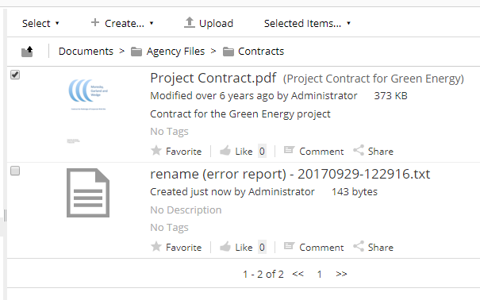

# alfresco-classifying-action
This project is one of the developments made in keensoft during Alfresco Global Hackaton 2017.

We have found that many times you need to run an action with different parameters for each document and this parameters are in some kind of document. 
This action allows to define actions that receive the resolved parameter for the document to make some work.

## Use case example
### Requirement
A company needs to deliver invoice documents to his clients and the email for each recipient is mantained in a CSV file that matches company name with email. The invoice documents name contains company name.
### Solution
1. The action parses the CSV file. Each line corresponds to one client and data is separated by '|': _keensoft|daniel.fernandez@keensoft.es_.
2. For each document the action searchs the CSV line matching by '_name contains item_', where _item_ is the first part of each line: _keensoft_.
3. The action executes, taking as parameter the CSV line representing the client for the document, so it can get the _email_: _daniel.fernandez@keensoft_.
### Extras
It would be great to use the same action module for similar flows like:
* Rename documents, with new _name_ obtained from classifier: _CLI0001 - Consulting services invoice.pdf_ -> _keensoft - Consulting services invoice.pdf_.
* Protect PDF with password, with _password_ obtained from classifier: _keensoft_ -> _Ws$e._.
* Send PDF password to client, with _mail_ and _password_ obtained from classifier: _keensoft_ -> _Ws$e._, _daniel.fernandez@keensoft_.

so there is a generic module that allows to define new flows based on the same principle. 
There is no need to copy the module and rename everything for each action!

## Description of the project
It is composed of share and repository actions, as usual.
### classifying-action-share
It contains:
* Action definitions.
* Messages
* Icons.
* Javascript to show waiting dialog.

The action invoked in repository is always the same but specifies the parameter _configuration_ that determines the flow to be executed.

### classifying-action-repo
There is only one defined action that executes all flows based on received parameter. 
The parameter specifies one of the configurations provided in alfresco-global.properties. It contains:
* Spring beans definitions.
* Java source code:
  * Action executer.
  * Parsers -> They read classifiers document to obtain all the classifiers files.
  * Classifiers -> They search in classifiers for the row that corresponds to the document.
  * Actions -> The do the work with the classifiers line.
* Example alfresco-global.properties.

## Provided code:
### Parsers
* **csv-clasiffiers-parser** -> It expects documents in plain text. One line for each classifying set. Set items separated by '|'.
### Classifiers
* **document-name-contains-classifier** -> It checks if document name contains the item (wich index is configured in action definition) to take the classifers set.
### Actions
* **rename-action** -> Changes the document name taking new one from classifiers set received.
* **pdf-protect-action** -> Protects PDF document with password obtained from classifiers set received.
* **send-password-by-mail-action** -> Sends password by mail, obtaining both the password and the recipient from classifiers set received. It uses a configured template.
* **send-by-mail-action** -> Sends document bu mail, obtaining the recipient from classifiers set received. It uses a configured template.

## Configuration:
### alfresco-global.properties
#### Module configuration
List of actions configured in module:
```
es.keensoft.alfresco.classifying-action.actions=rename,pdf-protect,send-by-mail,send-password-by-mail
```
Document containing the classifiers (nodeRef):
```
es.keensoft.alfresco.classifying-action.classifier-document=workspace://SpacesStore/185de60c-3759-4667-9cd0-8a18b132f6cf
```
Each action is defined by a group of properties:

* Classifier Spring bean name to match the document with the corresponding set of values: 
```
es.keensoft.alfresco.classifying-action.send-password-by-mail.classifier=document-name-contains-classifier
```
* Value index used in each classifier set to do the matching:
```
es.keensoft.alfresco.classifying-action.send-password-by-mail.classifier.key-index=1
```
* Action Spring bean name to do the work:
```
es.keensoft.alfresco.classifying-action.send-password-by-mail.action=send-password-by-mail-action
```
* Extra parameters for the action in the form of 'key=value' and separated by '|':
```
es.keensoft.alfresco.classifying-action.send-password-by-mail.extra-params=subject=Contrase\u00f1a facturas|template=workspace://SpacesStore/a974e2b1-2847-4622-b711-72f94d9a2c1a
```
Each group of properties contains the defined action name configured in the first property:

```es.keensoft.alfresco.classifying-action.```**send-password-by-mail**```.classifier```

#### Mail server configuration
The module uses mail service from Alfresco to send the mails so it must be configured. For example:
```
mail.host=smtp.gmail.com
mail.port=465
mail.username=name@gmail.com
mail.password=password
mail.protocol=smtps
mail.smtps.starttls.enable=true
mail.smtps.auth=true
```

### Required documents
Provided actions require:
* Classifiers document.
* Template for password sending mail.
* Template for document sending mail.

You can use the examples provided in: ```src/main/files``` in repository project.

## Usage:
When the module initializes parses alfresco-global.properties to prepare available actions. 
If everything is ok you should see four new actions in Share, available to folders and documents:


Before action execution it checks if classifiers document has changed to load new classfiers if needed. Then it searchs for the classifers set for the document and executes action. After executing the action it creates a new version.

When launched against folder each document open news transaction so failure in one document doesn't affect the others. In case of error a report is generated in the folder with details of execution for each document.




## Extending
### New action with existent implementations
To create a new action with current implementations you need to:
* Add the new action to alfresco-global.properties as explained in configuration section.
* Add resources to share-project:
  * Icon.
  * Messages.
  * Action definition in share-config-custom.xml:


'configuration' parameter specifies the configuration key previously configured in alfresco-global.properties.

### Parsers
New parsers can be added by implementing:
```
public interface ClassifiersParserInterface {
	/**
	 * Parses the document that contains classifiers. For each entity there is 
	 * an ordered array of values.
	 * @param nodeRef NodeRef of document
	 * @return List of classifiers arrays
	 */
	List<String[]> parseClassifiers(NodeRef nodeRef);
}
```
and adding the corresponding bean to Spring configuration.

### Classifiers
New classifiers can be added by implementing:
```
public interface ClassifierInterface {
	/**
	 * Determines the array of values, matching by node and the provided index
	 * @param nodeRef Document to get values for
	 * @param classifiersValues All the values arrays parsed
	 * @param keyIndex Index for the value to use as key in the matching with document
	 * @return Values array for document
	 */
	public String[] getValuesRow(NodeRef nodeRef, List<String[]> classifiersValues, int keyIndex);
}
```
and adding the corresponding bean to Spring configuration.
### Actions
New actions can be added by implementing:
```
public interface ClassifyingActionInterface {
	/**
	 * Executes the action upon the document
	 * @param nodeRef NodeRef of the document
	 * @param classifierValuesRow Classifiers values matched for this document 
	 * @param extraParams Extra parameters configured for the action, in form of key-value
	 */
	public void execute(NodeRef nodeRef, String[] classifierValuesRow, Map<String, String> extraParams);
}

```
and adding the corresponding bean to Spring configuration.


